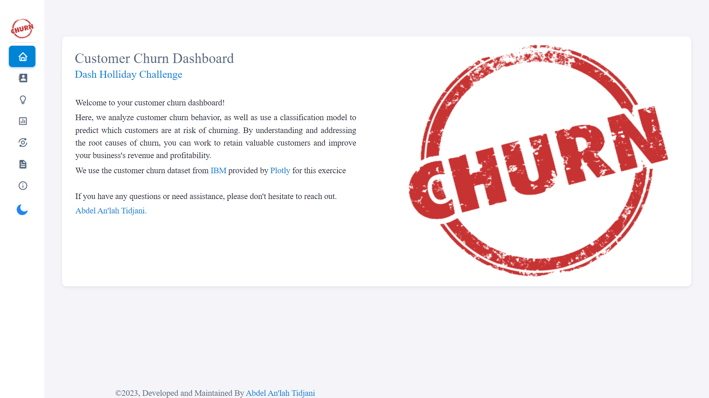

# Holiday Plotly Dash Challenge

A Plotly Dash app that utilizes Plotly's data visualization  to provide a clear and interactive representation of  customer churn data. Analyze customer churn behavior, as well as use a classification model to predict which customers are at risk of churning.

### About the App:

In order to run the app locally, please create a virtual environment with the provided `requirements.txt`. Then simply run `app.py`, open your browser and go to `http://127.0.0.1:8050/`
